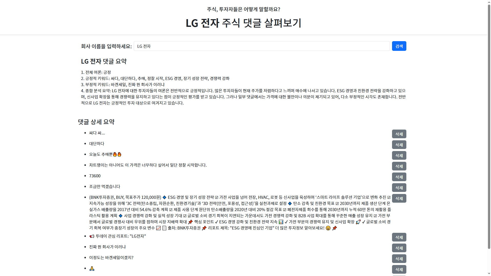
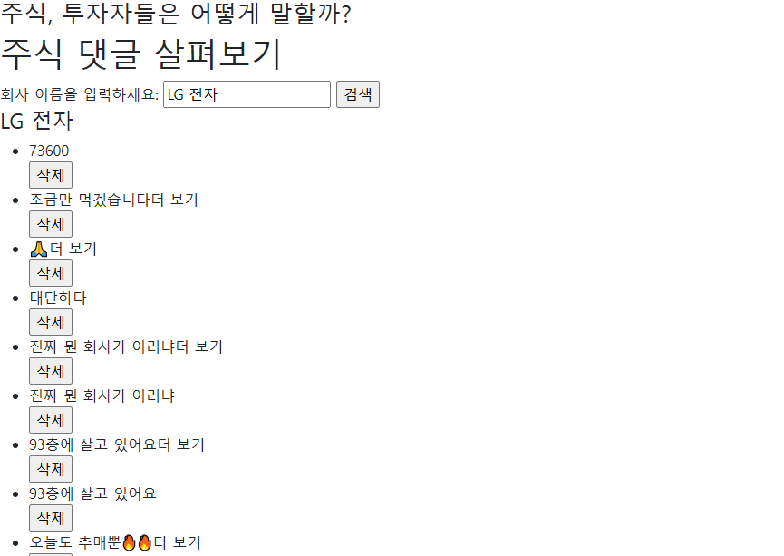
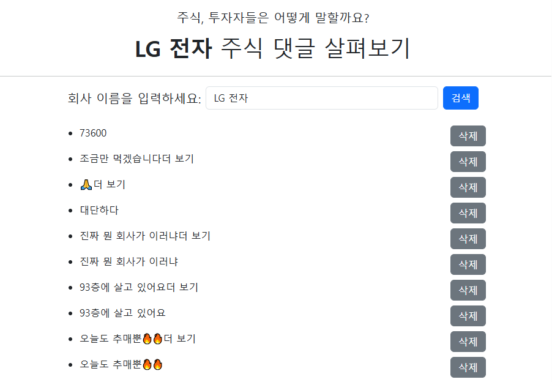

# 03_pjt: 금융 데이터를 이용한 댓글 요약 서비스
## 설명

사용자가 원하는 기업을 검색할 경우, 토스 증권의 댓글을 크롤링하여 기업의 주식에 관한 대중의 의견을 단편적으로나마 파악할 수 있도록 한 토이 프로젝트입니다.

=======
# 03_pjt: 금융 데이터
## 기본 화면

## 역할 분담
- 김나연: 크롤링 기본 코드 작성, API 이용한 요약문 생성
- 이예영: Django, UXUI 개선, 크롤링 코드 개선


# 과정 1. 기본 구성

## Django 프로젝트 생성

```python
python -m venv venv
source venv/Scripts/activate
pip install -r requirements
```

- 환경 설정 문제
  - 파이썬 버젼이 맞지 않음
    ```python
        py -3.8 -m venv venv
    ```
    - 이런 식으로 시도했으나 버젼이 낮아 로컬 자체의 파이썬을 삭제한 후 다시 깔아줌
    - Window에서 기본 제공하는 파이썬이 3.8이라 계속 충돌 > 관리자 권한으로 삭제 후 최신 버젼 설치, 환경변수 설정
  - gcc 버젼이 맞지 않음
    - msys로 다시 깔고 mingw64 제거
  - 패키지 충돌 문제
    - requirement.txt에서 필요한 것 외의 패키지 모두 삭제

## URL 지정

```python
from django.urls import path
from . import views

app_name = 'crawlings'
urlpatterns = [
    path('', views.index, name='index'),
    path('<str:company_name>/', views.index, name='index'),
    path('<int:pk>/delete_comment/', views.delete_comment, name='delete_comment'),
]
```

- 주어진 view 함수에 맞는 URL 우선 생성
- 이후 `path('<str:company_name>/', views.index, name='index')` 추가
  - redirect 할 때 `company_name`가 유실되어 화면에 있던 댓글이 모두 사라지는 문제 발생
  - 위의 문제를 해결하기 위해서 `company_name`을 url을 통해 넘겨줌

## View 함수 생성

```python
def index(request):
    if request.method == 'POST':
        company_name = request.POST.get('company_name')
        if not Comment.objects.exists():
            crawl_and_save_comments(company_name)
        print('post')
    else:
        company_name = request.GET.get('company_name')
        print('get')

    comments = Comment.objects.filter(company_name=company_name)
    print(comments)
    context = {
        'company_name': company_name,
        'comments': comments,
    }
    return render(request, 'crawlings/stock_finder.html', context)


def delete_comment(request, pk):
    comment = Comment.objects.get(pk=pk)
    company_name = comment.company_name
    comment.delete()
    return redirect(f'/crawlings/?company_name={company_name}')
```

### index 함수

- stock_finder 화면을 출력하기 위한 함수
- [DB에 comapany_name이 없는 경우 > 크롤링 실행](#index-함수)으로 하여 매번 다시 검색했을 때 로딩되는 속도를 줄임

### delete_comment 함수

- 댓글 삭제 후 화면 리다이렉트
- 이때 `redirect('crawlings:index')`를 하면 company_name에 None이 할당되면서 모든 댓글이 출력되지 않는 현상 발생
- 그렇기 때문에 `redirect(f'/crawlings/?company_name={company_name}')` 해야 함

### 화면 출력 예시



# 과정 2. UI 개선

|                            수정 전                            |                       수정 후                       |
| :-----------------------------------------------------------: | :-------------------------------------------------: |
|  |  |

## 개선 사항


- 검색 시 주식 댓글 살펴보기 제목 앞으로 회사 이름이 출력되게 함
- 검색창, 댓글 부분을 flex로 설정해 정렬
- padding, margin 세부 조정으로 component 크기 조정 및 배열 조절

# 과정 3. Index 함수 개선

```python
if not Comment.objects.exists():
    crawl_and_save_comments(company_name)
```

- 이런 형태로 예외 처리를 할 경우 새로운 검색어에 대해 검색이 수행되지 않는 문제가 발생

```python
if not Comment.objects.filter(company_name=company_name).exists():
    crawl_and_save_comments(company_name)
```

- filter를 부여해 변경

## 더 개선할 수 있는 부분

- saved_at의 요소를 이용해 가장 최근에 저장된 댓글이 얼마나 최신인지를 판단, 기준 시간이 경과하였으면 다시 검색을 수행해 새로운 내용으로 업데이트 하는 식으로 가능할 듯

# 과정 4. Crawling 코드 개선

## 문제 상황 - 기존 코드

```python
    soup = BeautifulSoup(driver.page_source, "html.parser")
    comments = soup.select("span[class*='tw-'][class*='1sihfl60']")

    for c in comments:
        text = c.get_text(strip=True)
        if text:
            Comment.objects.create(
                company_name=company_name,
                company_code=stock_code,
                comment=text
            )
```

1. 같은 내용의 댓글이 두 개 출력 됨

## 해결 - set 함수 활용

```python
    comments = driver.find_elements(By.CSS_SELECTOR, "span[class*='tw-'][class*='1sihfl60']")
    texts = [c.text.replace("더 보기", "").strip() for c in comments if c.text.replace("더 보기", "").strip() != ""]
    texts = list(set(texts))
    for c in texts:
        Comment.objects.create(
            company_name=company_name,
            company_code=stock_code,
            comment=c
        )
```

- `더 보기`가 붙은 댓글은 `더 보기` 삭제 후 리스트에 저장
- set 함수로 중복 제거 후 저장

### 개선할 수 있는 부분

토스 증권의 경우 스크롤이 되면 아래 있는 내용이 보이는 형태의 사이트이기 때문에, 크롤링 당시 로딩된 화면 내의 댓글만 저장하는 상황. 자동으로 스크롤 하는 코드를 추가해 크롤링 하는 댓글의 수를 늘릴 수 있을 것이라고 생각함.

# 과정 5. 댓글 요약 기능 추가 및 UI 최종 개선

## 수정 사항
- 글꼴 통일: pre로 감싼 html의 경우 굴림으로 출력되어 noto-sans로 전체 글꼴을 통일함
- 배치 수정: 댓글 요약을 먼저 볼 수 있도록 상단에 배치
- prompt 수정: 존댓말로 출력될 수 있도록 수정

# 마무리
## 역할 분담에 관해
- 각자 맡은 업무의 경계가 뚜렷하지 않았던 점이 아쉬웠다.
    - 각자 맡은 부분에 있어서 상대방과 싱크가 맞도록 실시간으로 공유하는 것이 가장 중요하다고 느꼈다.
## 추가 업무에 관해
- UI의 경우 개선이 필수사항은 아니었으니 부트스트랩을 이용해 간단하게나마 개선하고 나니 확실히 사용자가 이용하기 좋은 환경이 되었다.

## 크롤링에 관해
- 크롤링 한 데이터를 보여줄 때 관건은 다음과 같다는 생각이 들었다. 아래의 문제들을 해결하면 사용자 경험이 더욱 향상된 페이지를 구성할 수 있을 것이라 생각했다.
    - 크롤링 페이지가 동적으로 이뤄져 있는지 
    - 크롤링되는 대상의 selector가 변할 땐 출력되지 않을 수가 있는데, 이는 유지 보수의 측면에서 selector를 계속 업데이트 해야할지 아니면 seletor가 변해도 대응을 할 수 있는 방법을 찾아야 할지.
        - 후자가 더 바람직하다는 생각은 든다.
    - 크롤링 되고 화면에 출력하기 까지의 시간을 줄일 수 있는 방법은 없을지
## 프롬포트 엔지니어링에 관해
- 현재는 출력할 결과가 비교적 단순해 프롬포트 구성에 어려움이 없었지만 출력 결과가 다양해질 경우 프롬포트를 어떻게 구성해야할지 고민해봐야할 것 같다.
